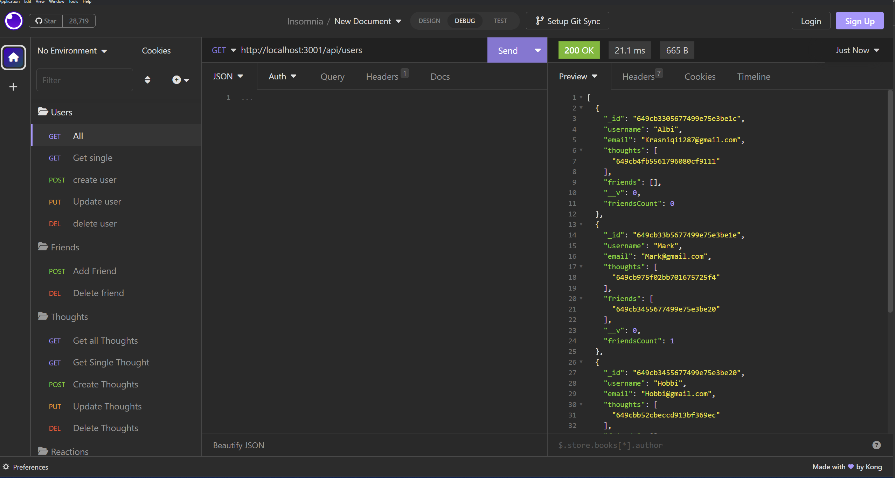
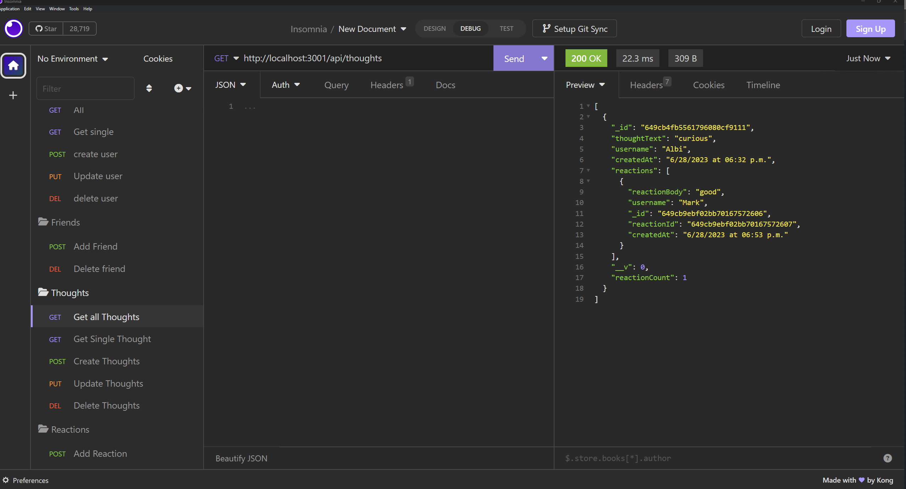
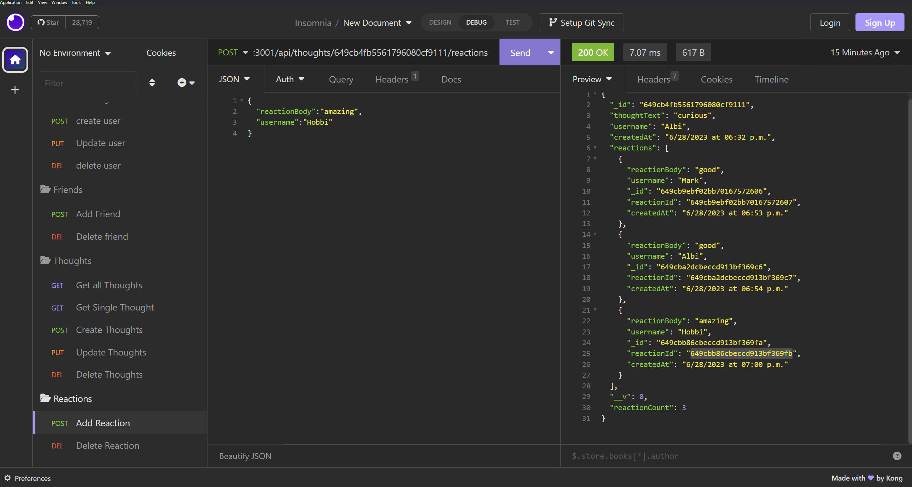

# socialMediaStartup

## Badges

## Description

- Motivation: To create a social database for me and my friends
- Goal: In order to have a website that says officailly me and my T.A and my professor are best friends
- Problems Solved: My loneliness
- What I Learned: i leanred how much better mongodb/mongoose is then sql. i definatly prefer this database software over sql it is much better in my humble opinion

## Installation

mongoose, express, nodemon

## Usage

## Credits

N/A

## License

This program is done under the license: [MIT License](https://choosealicense.com/licenses/mit/)

## How To Contribute

## Links

Github: https://github.com/Albikras/socialMediaStartup

## Screenshot

